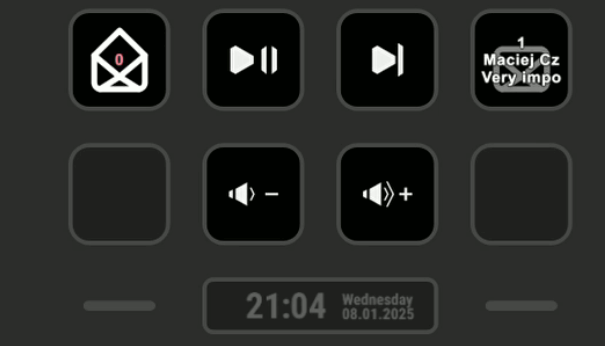

    

# Outlook Unread Counter - Stream Deck Plugin

A Stream Deck plugin that displays the number of unread emails from Microsoft Outlook directly on your Stream Deck.
No password needed as it uses MAPI to connect to Outlook.

    

## Features

- Real-time monitoring of unread email count
- Support for multiple Outlook accounts
- Visual indicators:
  - Closed envelope icon for unread messages
  - Open envelope icon for no unread messages
- Auto-refresh every 10 seconds
- Manual refresh on button press
- Possibility to display sender and/or subject of the last unread message

## Requirements

- Windows supporting MAPI
- Microsoft Outlook
- Elgato Stream Deck Software (minimum version 6)

## Installation

### Build from source
1. Use streamdeck_sdk tool to build the plugin `streamdeck_sdk build -i com.mcczarny.outlookunreadcounter.sdPlugin`
2. Install the plugin using the generated file in `releases` directory

### Install from releases
1. Download the latest release from the [releases page](https://github.com/McCzarny/OutlookUnreadCounter/releases)

## Usage

1. Drag the "Outlook Unread Counter" action onto your Stream Deck
2. Select your preferred Outlook account in the property inspector
3. The button will display:
   - The number of unread emails
   - A closed envelope icon when you have unread messages
   - An open envelope icon when all messages are read

## Author

Maciej Czarnecki

## License

[streamdeck_sdk](https://github.com/gri-gus/streamdeck-python-sdk) is licensed under the Apache-2.0 license.
My portion of the code is licensed under the MIT license.

## Support

Please use the issue tracker for support requests.
